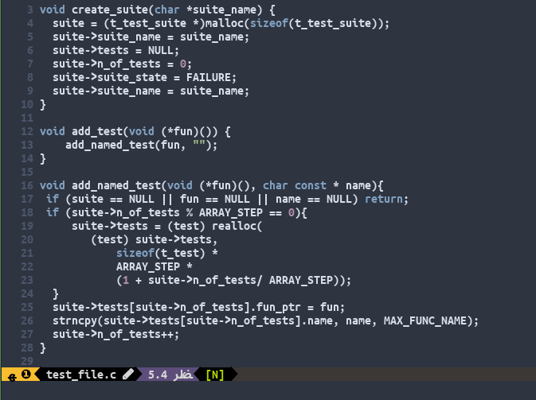

# vim-codepainter 🎨🖌

A plugin for Vim to color different parts of code making the use of text properties for vim (version >= 8.2.*) and `nvim_buf_add_highlight` function for nvim.

This plugin is made to manage the different "colors" that you can assign to the code. You can then save the marks and load them later!

## Demo

## Why

This project started because I felt the need of having an easy and straightforward way to highlight text in vim, mainly for code reviewing where I can paint different parts of code as I understand (or don't). Although after the first post on reddit, many people found many interesting ways of using it.

From simple note-taking to integration with testing frameworks to highlight failed tests or code coverage, feel free to use it to highlight anything!

## How to use

Once installed (I highly recommend [vim-plug](https://github.com/junegunn/vim-plug)), you need to set a color (or use default), select the area you want to "paint" and press F2 (default key-binding) to paint it. It works both for visual mode and visual block mode.

If you had something already painted, selecting and applying the same color will result on removing it. If you paint it with another color, it will replace it for the new one.

### Changing between colors

There are 10 colors pre-defined on the plugin source (named "paint<n>"). You can use any highlight group you want using `:PainterChangeColor <number>` for the default ones or `:PainterChangeColorByName <name>` to supply your own highlight group. The default group is "paint0".

### Cleaning everything

If you want to remove every marker and every match rule, you should run the command `:PainterEraseAll`

### Saving the Marks

Use the command `:PainterSaveMarks <path>` to create a json file with the marks. If no path is supplied, it will use the file's path and create a file with the same name.

### Loading Marks from a file

The command `:PainterLoadMarks <path>` lets you load the marks saved previously. If a path is not supplied, it will use the current file path and try to load a json file with the same filename of the current file.

By default, the plugin will try to automatically load the marks of the current file if they exist. You can disable this feature by changing the flag `g:auto_load_marks` to 0 in the plugin source.

### Known Issues

There are some cases where it's hard to delete a paint unless you find the exact positions where you placed it using `echom g:marks[<line_number>]`. To avoid using this, there is a function called `:PainterEraseLine <line_number>` which can delete all the marks on that line.

### Bugs

If you find a bug, feel free to open an issue about it!
